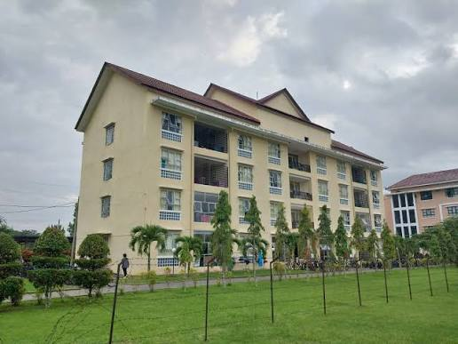

/*
NAMA   : Christian Junior Panjaitan
NIM    : 41426027
PRODI  : D4 Teknologi Rekayasa Perangkat Lunak
*/

1. PERIAPAN
Sebelum saya mulai, saya membuat folder untuk minggu 3 dan subfolder sesi-2 dan sesi-3 lalu saya menyiapkan index.html, README.md, dan folder bukti pada sesi yang dikerjakan. Setelah itu saya menjalankan server lokal sesuai cara yang dipakai pada Minggu 1 dan memastikan ketersediaan Git dengan git --version.

2.  MENYIAPKAN FORM DAN ATURAN WAJIB
Saya menyalin index.html Sesi 2 ke folder sesi-03, saya memastikan label, fieldset, legend, dan name benar serta mempertahankan required pada nama, email, select, serta kelompok radio. lalu saya menambahkan jumlah tiket wajib dengan batas melalui: 
<label for="jumlah">Jumlah tiket (1-5, wajib)</label>
<input id="jumlah" name="jumlah" type="number"
       min="1" max="5" step="1" required>
Setelah itu saya menguji dengan meninggalkan kotak kosong, memasukkan 0, 1, 5, 6, dan 1.5.

3. FORMAT DAN PETUNJUK YANG TERHUBUNG
Saya menambahkan kode peserta latihan (ini bukan format NIM resmi kampus) melalui:
<label for="kode">Kode peserta (6 angka, wajib)</label>

Contoh: 001234. Gunakan tepat enam angka.

<input id="kode" name="kode" type="text"
       inputmode="numeric" pattern="[0-9]{6}"
       aria-describedby="kode-help" required>
Lalu saya melakkan pengujian dengan meninggalkan kotak kosong, memasukkan 001234, 12345 dan abc123.
Perbedaan inputmode dengan validasi
Kalau inputmode memgatur pengalaman pengguna saat mengetik sedangkan Validasi adalah proses memeriksa apakah ada kesalahan pada situs web.

4. KEYBOARD DAN FOKUS
Saya membuat style.css yang saya hubungkan dari head. Lalu, saya menambahkan
input:focus-visible, select:focus-visible,
textarea:focus-visible, button:focus-visible {
  outline: 3px solid #175cd3;
  outline-offset: 3px;
}
pada file style.css. Setelah itu saya mencoba untuk mengisi dan mengirim form dengan keyboard, tidak ada hambatan yang saya temui.

5. GAMBAR DAN AUDIT AKSESIBILITAS
Saya menambahkan
 <figure>
    
    <figcaption>Lokasi kegiatan: aula kampus.</figcaption>
  </figure>
  dan gambar tersebut saya ambil dari "https://semat.del.ac.id/fasilitas". Lalu saya melakukan pemeriksaan terhadap HTML.

  6.  MATRIKS UJI DAN EKSPERIMEN KEGAGALAN
  | Kasus | Harapan |
| :--- | :--- |
| Email kosong | Ditolak karena required(harus diisi) |
| Email abc | Ditolak karena bentuk email(harus menggunakan format sesuai permintaan) |
| Email contoh valid | Diterima jika lainnya valid(tidak ada masalah) |
| Jumlah kosong | ditolak(saat kosong muncul teks yang menyatakan harus berisi) |
| Jumlah 0 / 6 | Ditolak(saat 0 muncul teks yang menyatakan harus lebih besar dari atau sama dengan 1, saat 6 muncul teks yang menyatakan harus <=5) |
| Jumlah 1 / 5 | Diterima(tidak terjadi masalah) |
| Jumlah 1.5 | Ditolak bila step=1(uncul teks yang menyatakan harus menggunakan nilai yang valid) |
| Kode 12345 | Ditolak(harus diawali 0) |
| Kode 001234 | Diterima(tidak terjadi masalah) |
| Keyboard | Semua kontrol dapat dicapai |
alasan mengapa server tetap perlu memvalidasi adalah karena validasi dari sisi pengguna rentan terhadap attacker(pengguna berniat jahat).